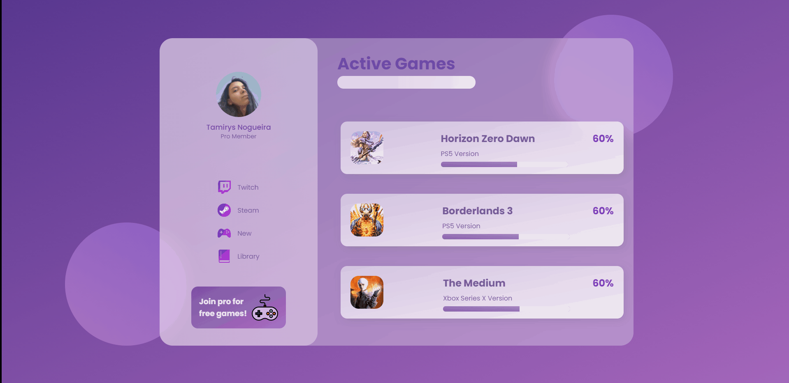

<h1 align="center">
    
     
     
    Glass - Website
</h1>

    
        

<h4 align="center">
    Projeto de interface desenvolvido através de um tutorial do desenvovedor

[Simo Edwin](https://www.youtube.com/watch?v=O7WbVj5apxU&t=76s), utilizando a temática de games.
</h4>
 

    

 

#### 🚀 Tecnologias

 

Feito com 💖 por TamirysNogueira. [Get in Touch!](https://www.linkedin.com/in/tamirys-nogueira-346958205/)